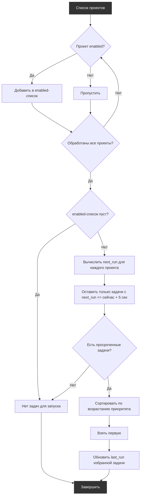

# RPA Scheduler  
## [Первый Бит, Центр Корпоративных Клиентов, отдел BIRPA]  
`Версия: [2.1.2] - 15-11-2025`

## Оглавление

- [Обзор](#обзор)
- [Требуемые компоненты](#требуемые-компоненты)
- [Структура проекта](#структура-проекта)
- [Конфигурация планировщика](#конфигурация-планировщика)
- [Конфигурация задач](#конфигурация-задач)
- [Критерии выбора](#критерии-выбора)
- [Ключевые параметры](#ключевые-параметры)
- [Примеры конфигурационных файлов](#примеры-конфигурационных-файлов)
  - [config.json](#configjson)
  - [schedule.json](#schedulejson)
- [Использование](#использование)
  - [Шаги внедрения](#шаги-внедрения)
  - [Запуск вручную (тестирование)](#запуск-вручную-тестирование)
  - [Типовые ошибки и диагностика](#типовые-ошибки-и-диагностика)
- [Поддержка](#поддержка)
- [Changelog](#changelog)

## Обзор  
**RPA Scheduler** — это централизованный планировщик задач для PIX‑роботов. Вместо того чтобы добавлять каждый скрипт в Планировщик Windows по отдельности и вручную контролировать их взаимные запуски, вы используете данный проект как единую точку входа.

Планировщик автоматически определяет, какую задачу запустить следующей, на основе:
- текущего времени,
- расписания (cron‑выражений),
- приоритетов,
- времени последнего запуска.

При каждом запуске (например, по триггеру из Task Scheduler) планировщик:
1. Анализирует конфигурацию всех подчинённых задач.
2. Выбирает задачу, которая должна выполняться в данный момент.
3. Запускает соответствующий `main.pix` и **дожидается его завершения**.
4. Обновляет `last_run` выбранной задачи сразу же после её запуска.

Такой подход исключает параллельное выполнение роботов, упрощает управление расписанием и централизует логику запуска.

## Требуемые компоненты
1. [Пользовательские активности](https://disk.yandex.ru/d/5_aIXz_jzO6Y2g) (включая общий фреймворк `rpa_framework`)  
*Перед запуском импортируйте библиотеки в каталог платформы.  
Описание активностей в readme.md по ссылке*
2. Планировщик заданий Windows для автоматического запуска  
> ⚠️Совместимо с PIX Studio v2⚠️

## Структура проекта

Проект организован следующим образом (некоторые каталоги создаются автоматически при первом запуске через `rpa_framework`):

```
rpa_scheduler
├───data
│   ├───configs
│   │       config.json             # Основные настройки робота
│   │       schedule.json           # Расписание запуска проектов
│   ├───logs                        # Логи выполнения (создаётся фреймворком)
│   ├───tmp                         # Временные файлы (создаётся фреймворком)
│   ├───errors                      # Сохранённые ошибки/скриншоты (создаётся фреймворком)
│   └───transactions                # Данные транзакций (создаётся фреймворком)
│       ├───archive                 # Архив обработанных транзакций
│       └───transactions.csv        # Текущий файл транзакций
├───docs
│   └───readme.md                   # Документация проекта (текущий файл)
└───src
    ├───get_next_task_to_run.pix    # Скрипт выбора следующей задачи по расписанию
    ├───main.pix                    # Главный исполняемый скрипт
    └───rpa_scheduler.pixproj       # Файл проекта Pix Studio
```

## Конфигурация планировщика

Планировщик сам является проектом PIX и использует общий фреймворк `rpa_framework` (библиотеку вспомогательных скриптов). При запуске фреймворк инициализирует окружение, проверяет каталоги, а также пытается считать технические окна из конфигурационного файла проекта.

Чтобы фреймворк не выдавал ошибок, в корневой папке планировщика должен присутствовать файл `config.json`. Для использования инициализации через фреймворк (уведомления, работа с учётными данными, производственный календарь и т.д.) файл содержит множество дополнительных параметров, необходимых для работы фреймворка, но не используемых непосредственно планировщиком.

**Полный пример файла `config.json` приведён в разделе [Примеры конфигурационных файлов](#примеры-конфигурационных-файлов).**

## Конфигурация задач

Все задачи, управляемые планировщиком, описываются в файле `schedule.json`. Каждая задача представляется отдельным объектом с ключом — произвольным именем проекта.

**Полный пример файла `schedule.json` приведён в разделе [Примеры конфигурационных файлов](#примеры-конфигурационных-файлов).**

### Поля конфигурации задачи
- `enabled` — включена ли задача в планирование (true/false).
- `last_run` — дата и время последнего запуска в формате `dd.MM.yyyy HH:mm` (обновляется автоматически).
- `priority` — приоритет задачи (меньшее число = выше приоритет).
- `main_file` — полный путь к исполняемому файлу `main.pix` робота.
- `cron` — расписание в формате Quartz Cron.
- (опционально) `_comment_cron` — пояснение к cron-выражению (игнорируется планировщиком, полезно для расшифровки сотрудником).

> ⚠️ **Важно**: частота запуска самого планировщика (через Task Scheduler) должна быть **выше или равна** самому короткому интервалу в cron‑выражениях задач, иначе некоторые запуски могут пропускаться.  
> Для генерации cron‑выражений удобно использовать [онлайн‑инструмент](https://www.freeformatter.com/cron-expression-generator-quartz.html).

## Критерии выбора


> Для выбранной задачи обновляется поле `last_run`  
Обновленная конфигурация сохраняется в исходный файл

## Ключевые параметры

В процессе работы планировщик определяет следующие параметры для запуска выбранной задачи:

| Ключ | Тип | Описание |
|------|-----|----------|
| `selected_project_name` | `string` | Имя проекта из `schedule.json`, который требуется запустить |
| `main_file` | `string` | Путь к файлу `main.pix` этого проекта |

Эти параметры используются только внутри планировщика и не возвращаются во внешнюю среду. После выполнения обновляется только поле `last_run` в конфигурации.

## Примеры конфигурационных файлов

Здесь приведены полные примеры файлов `config.json` и `schedule.json` с типовыми настройками.  
Чувствительные данные (пути, email, имена учётных записей) заменены на обобщённые.

### config.json

```json
{
    "metadata": {
        "version": "3.0",
        "description": "RPA Scheduler config",
        "contact_us": "support@example.com"
    },
    "process": {
        "name": "Планировщик роботов",
        "log_config_on_init": false,
        "log_state_monitor": false
    },
    "transaction_handling": {
        "max_serial_errors": 3,
        "max_batch_size": 10,
        "seconds_per_transaction": 60,
        "base_delay_sec": 10,
        "notification": {
            "enabled": true,
            "interval": 5
        }
    },
    "maintenance": {
        "enabled": true,
        "cron": "0 0 1-3 ? * SUN,MON,WED,FRI *",
        "window_ahead_min": 10
    },
    "credentials": {
        "names": ["Email"]
    },
    "notifications": {
        "recipients": ["your-email@example.com"],
        "smtp": {
            "server": "smtp.yandex.ru",
            "port": 587
        },
        "imap": {
            "server": "imap.yandex.ru",
            "port": 993
        },
        "ssl": true
    },
    "production_calendar": {
        "enabled": false,
        "country": "ru"
    },
    "1c_settings": [],
    "cleanup": {
        "processes": {
            "names": ["excel", "firefox"]
        },
        "transactions": {
            "lifetime_days": 30
        },
        "logs": {
            "lifetime_days": 30,
            "archive_instead_of_delete": true
        },
        "errors": {
            "lifetime_days": 30
        }
    }
}
```

### schedule.json

```json
{
  "01 Проверка телефона в шапке": {
    "enabled": true,
    "last_run": "01.08.2025 15:48",
    "priority": 1,
    "main_file": "C:\\RPA\\Projects\\01 Проверка телефона в шапке\\src\\main.pix",
    "cron": "0 0 23 ? * TUE,THU *"
  },
  "02 Проверка формы на странице автоматизации": {
    "enabled": true,
    "last_run": "10.07.2025 11:56",
    "priority": 2,
    "main_file": "C:\\RPA\\Projects\\02 Проверка формы на странице автоматизации\\src\\main.pix",
    "cron": "0 0 10-12,15-17 ? FEB,MAR,OCT TUE,THU *"
  }
}
```

> ⚠️ В примере `schedule.json` пути к файлам указаны как абсолютные. При развёртывании замените их на актуальные пути в вашей системе. Поле `last_run` будет обновляться автоматически после каждого запуска задачи.

## Использование

### Шаги внедрения

1. **Настройте расписание роботов**  
   Для каждого робота создайте блок в `schedule.json`, указав `enabled`, `main_file`, `cron`, `priority` и, при необходимости, `maintenance`.  
   *Обратитесь к разделу [Конфигурация задач](#конфигурация-задач) и [примеру schedule.json](#schedulejson) для правильного заполнения.*

2. **Импортируйте пользовательские активности**  
   Скачайте библиотеки по ссылке из раздела «Требования» и поместите их в каталог PIX Studio. Убедитесь, что проект запускается без ошибок.

3. **Запланируйте запуск планировщика**  
   Создайте задачу в Планировщике Windows, которая будет запускать `main.pix` с нужной периодичностью (например, раз в 5 минут). Частота должна быть не реже, чем минимальный интервал в cron‑задачах.  
   Для запуска планировщика (например, при настройке задачи в Планировщике Windows или для быстрого тестирования) используйте команду:

    ```cmd
    "C:\Program Files\PIX\Robot.exe" -f "C:\Путь\к\вашему\планировщику\main.pix"
    ```
    - **`"C:\Program Files\PIX\Robot.exe"`** — исполняемый файл PIX Robot. Путь может отличаться в зависимости от места установки.
    - **`-f`** — параметр, указывающий на запуск конкретного файла `.pix`.
    - **`"C:\Путь\к\вашему\планировщику\main.pix"`** — полный путь до главного файла планировщика. Замените на актуальный путь в вашей системе.

      При таком вызове планировщик выполнит одну итерацию: проанализирует конфигурацию, при необходимости запустит выбранного робота и завершится. Для постоянной работы эту команду следует поместить в Планировщик Windows с требуемой периодичностью.

4. **Мониторинг**  
   Планировщик самостоятельно определяет необходимость запуска. Если в текущий момент нечего запускать, он завершается без действий. Логи и ошибки записываются в стандартный каталог `rpa_scheduler\data\logs`.

### Запуск вручную (тестирование)

- Откройте `main.pix` в PIX Studio.
- Проверьте корректность путей `framework_root` и `project_root`.
- Выполните скрипт. При необходимости проанализируйте лог‑файлы.

### Типовые ошибки и диагностика

| Проблема | Возможные причины |
|----------|-------------------|
| Нужный робот не запускается | Неверное cron‑выражение, слишком редкий запуск планировщика, выключен `enabled` |
| Ошибки при выполнении робота | Неправильные пути к каталогам/файлам, ошибки в `schedule.json` (некорректный JSON) |

В первую очередь проверяйте логи в `data/logs` и корректность конфигурации.

---

### Поддержка
При проблемах/предложениях по планировщику роботов: `ARBikmuhametov@1cbit.ru`  
Сообщения об ошибках должны содержать:  
- Контекст выполнения
- Ожидаемый и фактический результат

---

# Changelog
  <!-- ### Добавлено (Added) -->
  <!-- ### Изменено (Changed) -->
  <!-- ### Исправлено (Fixed) -->
  <!-- ### Удалено (Removed) -->
  <!-- ## [Unreleased] -->

  ## [2.1.2] - 15-11-2025
  ### Исправлено (Fixed)
  * В шаге выбора следующей задачи для запуска добавлен временной допуск в 5 секунд при сравнении времени (`next_run <= Now + 5 секунд`). Это позволяет корректно запускать задачи, даже если они рассчитаны с точностью до секунд, и предотвращает случайный пропуск задач из-за разницы в долях секунды между расчетом и фактическим временем проверки.

  ## [2.1.1] - 08-10-2025
  ### Исправлено (Fixed)
  * В скрипте `get_next_task_to_run.pix` для шага "Расчет времени запуска по CRON" параметр `Время последнего запуска` сделан обязательным.

  ## [2.1.0] - 01-09-2025
  ### Добавлено (Added)
  * В конфигурационный файл (`config.json`) добавлен блок `maintenance` для задания технических окон по cron-выражению. Теперь можно гибко указать периоды, в которые робот не должен работать.
  - **Проверка на старте:** Перед запуском робот проверяет, попадает ли текущее время в техническое окно. Это позволяет избежать случайных запусков в период недоступности даже при ошибках в расписании.
  - **Проверка в цикле обработки:** Во время длительной работы робот контролирует наступление технического окна и при необходимости завершает текущий цикл обработки, чтобы не нарушать регламент.
  - **Параметр `window_ahead_min`:** Позволяет задавать минимальное количество минут до начала технического окна, необходимое для запуска новой транзакции. Если до технического окна меньше указанного значения, новая обработка не запускается.

  Пример конфигурации:
  ```json
  "maintenance": {
      "_comment": "Тех. окна по одному cron-выражению. Если время попадает под любой из указанных дней/часов — робот не работает.",
      "enabled": true,
      "cron": "0 0 1-3 ? * SUN,MON,WED,FRI *",
      "_comment_cron": "С 01:00 до 03:59 каждое воскресенье, понедельник, среду и пятницу",
      "window_ahead_min": 30,
      "_comment_window_ahead_min": "Минимальное количество минут до наступления технического окна, которое должно оставаться для запуска новой транзакции. Например, если до начала тех. окна осталось меньше 30 минут, новая обработка не запускается."
  }
  ```

  ## [2.0.0] - 05-08-2025
  ### Добавлено (Added)
  * Добавлена поддержка CRON-выражений через использование библиотеки `Quartz.dll`  
  ### Изменено (Changed)
  * Изменена структура конфигурационного файла `schedule.json`: окна запусков заменены на cron-выражение